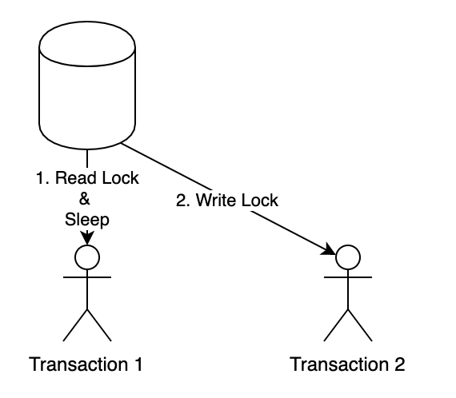

# 트랜잭션과 DB Lock


# 트랜잭션(Transacation)

- __정의__
    - 트랜잭션이란 데이터베이스의 상태를 변화시키는 하나의 `논리적인 작업 단위`라고 할 수 있으며, 트랜잭션에는 여러개의 연산이 수행될 수 있다.
- __특징__
    - 하나의 트랜잭션은 `Commit` 되거나 `Rollback` 된다.

## 트랜잭션을 사용하는 이유

- 트랜잭션은 하나의 논리적인 작업의 단위이기 때문에, `여러개의 작업을 하나의 논리적인 단위로 묶어서 반영과 복구를 조정할 수 있기 위해 사용`한다. 따라서, 데이터의 부정합이 일어났을 경우 롤백을 하여 데이터의 부정합을 방지할 수 있다.

- 트랜잭션의 마지막 상태는 다음과 같이 2가지 중 한가지를 가진다

  - commit : 트랜잭션이 정상적으로 완료된 상태를 의미한다.
  - rollback : 트랜잭션이 정상적으로 완료되지 않고, 종료된 상태로 트랜잭션 시작 전 상태로 돌아감을 의미.

  

## 트랜잭션의 성질

트랜잭션의 성질에는 ACID 가 있다.

- __Atomicity(원자성)__
    - 트랜잭션의 연산은 데이터베이스에 모두 반영되든지 아니면 전혀 반영되지 않아야 한다.
        - `All or Nothing`
    - 트랜잭션 내의 모든 명령은 반드시 완벽히 수행되어야 하며, 모두가 완벽히 수 행되지 않고 어느하나라도 오류가 발생하면 데이터베이스 상태를 트랜잭션 작업 이전으로 되돌려서 원자성을 보장
- __Consistency(일관성)__
    - 트랜잭션 수행 전과, 수행 완료 후의 `상태`가 같아야 한다.
    - 상태 : `트랜잭션 수행이 보존해야할 일관성`
        - 명시적인 일관성 : `기본 키, 외래 키 등과 같은 무결성 제약조건`
            - 무결성 제약조건을 해치지 않는 데이터들에 대해서만 트랜잭션이 성공적으로 수행되어야 한다.
        - 비명시적인 일관성 : Ex. 계좌 이체에서, A 계좌에서 출금이 일어나고 그 돈이 B 계좌로 입금된다 했을 때, 트랜잭션의 전과 후 두 계좌 잔고의 합이 같아야 한다.
- __Isolation(독립성, 격리성)__
    - 둘 이상의 트랜잭션이 동시에 병행 실행되는 경우 어느 하나의 트랜잭션 실행중에 다른 트랜잭션의 연산이 끼어들 수 없다.
    - 수행중인 트랜잭션은 완전히 완료될 때까지 다른 트랜잭션에서 수행 결과를 참조할 수 없다.
    - __격리성은 `읽기 일관성`과 `동시성`에 영향을 미치는 성질__
- __Durability(영속성, 지속성)__
    - 성공적으로 완료된 트랜잭션의 결과는 시스템이 고장나더라도 영구적으로 반영되어야 한다.

## 트랜잭션 격리 수준

트랜잭션 격리(고립화) 수준이 중요한 이유는, 격리 레벨을 어떻게 설정하느냐에 따라 읽기 일관성이 달라지기 때문이다. 

__즉, 트랜잭션 격리 수준에 따라 데이터 조회 결과가 달라질 수 있다는 말이다.__

이처럼 트랜잭션 격리 수준에 따라 데이터 조회 결과가 달라지게 하는 기술을 `MVCC(Multi Version Concurrency Consistency)` 라고 한다.

> MVCC는 동시 접근을 허용하는 데이터베이스에서 동시성을 제어하기 위해 사용하는 방법 중 하나이다. MVCC에서 데이터에 접근하는 사용자는 접근한 시점에 데이터베이스의 Snapshot을 읽는다. 이 snapshot 데이터에 대한 변경이 완료(commit)될 때 까지의 변경사항은 다른 데이터베이스 사용자가 볼 수 없다.


- READ UNCOMMITTED
- READ COMMITTED
- REPEATABLE READ
- SERIALIZABLE


### 레벨 0 : Read Uncommitted

- 트랜잭션에서 처리 중인, 아직 커밋 되지 않은 데이터를 다른 트랜잭션에서 읽는 것을 허용
- `Dirty Read, Non-Repeatable Read, Phantom Read 현상 발생`
- Oracle 에서는 이 레벨을 아예 지원하지 않음.
- MySQL 에서는 설정은 가능

### 레벨 1 : Read Committed

- `Dirty Read 방지` : 트랜잭션이 커밋되어 확정된 데이터를 읽는 것을 허용
- 대부분의 DBMS 가 기본 모드로 채택하고 있는 격리수준
    - Ex. Oracle, H2 등
    - 커밋된 정보만 읽는다.
- Non-Repeatable Read, Phantom Read 현상은 여전히 발생
- PostgreSQL, SQL Server 의 경우 `읽기 공유 Lock` 을 사용해서 구현한다. 하나의 레코드를 읽을 때 Lock 을 설정하고 해당 레코드를 빠져 나가는 순간 Lock 을 해제
- MySQL(InnoDB) 과 Oracle 은 Lock 을 사용하지 않고 쿼리 시작 시점의 `Undo` 데이터를 제공하는 방식

> RDBMS 에서 MVCC 는 구현 방식에 따라 2가지로 나뉘는데, Pessimistic Lock 을 사용하는 MGA(Multi Generation Architecture) 방식과 Undo Segment 를 사용하는 방식으로 나눠진다.
>
> 쉽게 말하면, RDBMS 마다 MVCC 기술을 구현하기 위해서 Lock 을 사용하는 방식을 쓸건지, Undo Segment 에서 데이터를 제공할껀지 선택하여 구현한다.

```
각 RDBMS에서 구현된 MVCC는 크게 그 구현 방식에 따라 2가지로 나눌 수 있다. 

1. Pessimistic Lock을 사용한 방식 
2. Undo Segment를 사용한 방식 

1. Perssimistic Lock을 사용하는 MGA 
처음 짐 스타키가 구현한 방식으로 MGA : Multi Generation Architecture라고 부른다. MGA는 튜플을 업데이트 할때 새로운 값으로 변경하는 것이 아니라, 즉, 같은 자리에서 Replace로 처리하는 것이 아니라 새로운 튜플을 추가하고 이전 튜플은 유효 범위를 마킹하여 처리한다. 

이와 같은 방식은 PostgreSQL, SQL Server, InterBase에서 사용하는 방식이다. 

2. Undo Segment를 사용하는 방식
Oracle, InnoDB에서 사용하는 방식으로 언두 라는 영역을 따로 두고 최신 데이터는 데이터 영역에 두고 올드 버젼만 언두 영역에 두어 레코드 갱신에 대한 버젼관리를 하는 방식이다.  이것은 1980년대에 오라클의 밥 마이너가 구현한 방식이다. 

만약, 변경 작업이 완료되지 않은 상태에서 다른 세션이 같은 영역에 읽기 작업을 하려고 한다면, DBMS는 각 레코드의 SCN 정보를 확인하여 언두 영역을 찾아서 해당 버젼의 레코드를 가져와 메모리에 로드하고 읽을 수 있게 처리해 준다. 
```


### 레벨 2 : Repeatable Read

- MySQL InnoDB 에서 기본으로 채택하고 있는 격리 수준
- 선행 트랜잭션이 읽은 데이터는 트랜잭션이 종료될 때가지 후행 트랜잭션이 `갱신하거나 삭제하는 것은 불허함`으로써 같은 데이터를 두 번 쿼리했을 때 일관성 있는 결과를 리턴
    - Insert 는 가능
- Phantom Read 현상은 여전히 발생
- PostgreSQL, SQL Server 의 경우 트랜잭션 격리 수준을 Repeatable Read 로 변경하면 읽은 데이터에 걸린 공유 Lock 을 커밋할 때까지 유지하는 방식으로 구현
- Oracle은 이 레벨을 명시적으로 지원하지 않지만 [for update](https://m.blog.naver.com/PostView.naver?isHttpsRedirect=true&blogId=tyboss&logNo=70101836923) 절을 이용해 구현가능.

> [JPA 는 1차 캐시를 통해서 Repeatable Read 를 애플리케이션 레벨에서 지원한다.](https://techvu.dev/116)

### 레벨 3 : Serializable Read

- 선행 트랜잭션이 읽은 데이터를 후행 트랜잭션이 갱신하거나 삭제하지 못할 뿐만 아니라 중간에 새로운 레코드를 삽입하는 것도 막아줌. 완벽하게 읽기 일관성 모드를 제공
    - `INSERT, UPDATE, DELETE 전부 불가능`
    - READ 시에 DML 작업이 동시에 진행될 수 없다.

## 트랜잭션 격리 수준을 설정할 때 발생 하는 문제점들

트랜잭션 격리 수준을 너무 낮게(0 레벨)하면 읽기 일관성을 제대로 보장할 수 없고, 반면 너무 높게하면, 읽기 일관성은 완벽하게 보장하지만 데이터를 처리하는 속도가 느려지게 된다. 

- Read Uncommitted > Read Committed > Repeatable Read > Serializable Read
    - ReadUncommitted 로 갈 수록 동시성은 높아지고, 일관성은 떨어진다.
    - Serializable Read 로 갈 수록 동시성은 떨어지고, 일관성은 높아진다.


따라서, 트랜잭션 격리 수준은 `일관성` 및 `동시성`과도 연관이 있다는 것을 알 수있다.

> 트랜잭션 성질 중 격리성은, 읽기 일관성과 동시성에 영향을 미치는 성질이라고 말할 수 있다.

격리성과 동시성으로부터 파생되는 문제점을 살펴보기 전에, MySQL InnoDB 아키텍처 중 일부에 대해서 배워보자.

| Isolation Level  | 설명                                            | Dirty Read | Non-Repeatable Read | Phantom Read | 고립성(안정성) | 동시성 |
| ---------------- | ----------------------------------------------- | ---------- | ------------------- | ------------ | -------------- | ------ |
| Read Uncommitted | 커밋되지 않은 데이터도 읽을 수 있다.            | O          | O                   | O            | 낮다           | 높다   |
| Read Committed   | 커밋된 정보만 읽는다.                           | X          | O                   | O            | 중간           | 중간   |
| Repeatable Read  | 하나의 트랜잭션에서는 하나의 스냅샷만 사용한다. | X          | X                   | O            | 중간           | 중간   |
| Serializable     | Read 시에 DML 작업이 동시에 진행될 수 없다.     | X          | X                   | X            | 높다           | 낮다   |

지금부터 아래에서 나올 그림들은 MySQL InnoDB 를 기준으로 설명한 그림이다.

### InnoDB 버퍼풀, Undo Log, Redo Log

- __InnoDB 버퍼풀__
    - 변경된 데이터를 디스크에 반영하기 전까지 잠시 버퍼링 하는 공간
- __Undo Log__
    - 변경되기 이전 데이터를 백업 해두는 공간
    - 트랜잭션 보장(Rollback 시 언두 로그에 백업된 데이터 복원)
    - 트랜잭션 격리 수준 보장(트랜잭션 격리 수준에 맞게, 백업된 데이터 반환)
- __Redo Log__
    - 변경된 데이터를 백업(Commit 완료된 데이터)
    - 영속성 보장(서버 비정상 종료 시, 리두 로그에 백업된 데이터 복원)

### Dirty Read

- __Dirty Read(Uncommitted Dependency)__
    - 아직 `커밋되지 않은` 수정 중인 데이터를 다른 트랜잭션에서 읽을 수 있도록 허용할 때 발생한다.
        - 데이터를 수정 중인 트랜잭션이 롤백하는 경우
        
        - 한 트랜잭션(T1)이 데이터에 접근하여 값을 A 에서 B 로 변경하였고 아직 커밋을 하지 않은 상태에서 다른 트랜잭션(T2)이 해당 데이터를 읽는다. T2가 읽은 데이타는 B가 될 것이다. 하지만 T1이 최종 커밋을 하지 않고 종료된다면, T2가 가진 데이타는 꼬이게 된다.
        
        - 
        
          
    
- __MySQL 과 Oracle 에서는 Undo Segment 를 통해서 Dirty Read 문제 해결__
    - 만약에, 회사에서 PostgreSQL or SQL Server 등 MVCC 기술을 구현하기 위해 Lock 을 사용하는 DBMS 를 사용한다면 이 부분에 대해서도 잘 알고 있어야 한다.


Dirty Read 는 UPDATE 쿼리문이 커밋되기 전에, 다른 트랜잭션에서 데이터를 읽으면, 코딩이 조회가 된다. 하지만 T1 트랜잭션에 문제가 생겨서 롤백이 되면 T2 가 조회한 값을 가지고 CUD 에 사용하였다면 데이터가 꼬이게 될 것이다.

### Non-Repeatable Read

Repeatable Read 의 특징을 반대로 생각하면 된다.

- __Non-Repeatable Read(Inconsistent Read)__
    - T1 이 A 테이블을 SELECT 한 후 T2 에서 A 테이블 내용을 UPDATE 한다고 가정. 
    - T2 가 해당 변경사항(UPDATE)을 COMMIT 한 이후에, T1 이 다시 A 테이블을 SELECT 하면 변경사항을 읽어들일 수 있음
    - 
    - 
    - 하나의 트랜잭션내에서 똑같은 SELECT 쿼리를 실행했을 때는 항상 같은 결과를 가져와야 하는 `REPEATABLE READ`의 정합성에 어긋난다.
    - 이러한 문제는 주로 입금, 출금 처리가 진행되는 금전적인 처리에서 주로 발생한다.
      - 데이터의 정합성은 깨지고, 버그는 찾기 어려워 진다.

### Phantom Read

- __Phantom Read__
    - T1 이 A 테이블에서 SELECT 한 이후 T2 에서 A 테이블에 내용을 추가(INSERT) 한다고 가정.
    - Repeatable Read 가 보장된 경우, A 테이블에서 SELECT 해왔던 데이터들을 T2 가 UPDATE 하여 COMMIT 한 후 T1 에서 다시 A 테이블을 SELECT 하더라도 T2 의 수정 내용을 읽어들일 수 없음
    - 하지만 T2 가 추가/삭제(INSERT)를 한 경우, 다시 A 테이블에서 SELECT 하게 되면 기존 A 에서 SELECT 했던 데이터에서 row 가 추가될 수 있다.(유령 데이터)


# 스프링과 트랜잭션

## 스프링에서 제공하는 트랜잭션 관리 방법

스프링에서는 프로그래밍을 통한 트랜잭션 관리와, 선언적 트랜잭션을 통한 관리 방법 2가지를 제공한다.

### Programmatic Transcation

- __PlatformTransactionManager 인스턴스 변수 선언__

```java
@Autowired
@Qualifier("txManager")
private PlatformTransactionManager txManager;
```

- __로직 구현__

```java
DefaultTransactionDefinnition def = new DefaultTransactionDefinition();
def.setPropagationBehavior(TransactionDefinition.PROPAGATION_REQUIRED);
TransacationStatus status = txManager.getTranscation(def);

try {
    // 생략
    txManager.commit(status);
} catch(ApplicationException e) {
    txManager.rollback(status);
}
```

- __순수 JPA 사용 시 트랜잭션 처리 방법__

```java
// 순수 JPA 사용 시 정석 코드
EntityManagerFactory emf = Persistence.createEntityManagerFactory(persistenceUnitName);
EntityManager em = emf.createEntityManager();
EntityTransaction tx = em.getTransaction();
tx.begin();
try {
    Member member = new Member();
    member.setId(1L);
    member.setUserName("Jungho");
    em.persist(member);
    tx.commit();
} catch (Exception e) {
    tx.rollback();
} finally {
    em.close();
}
emf.close();
```

### Declarative Transcation

선언적 트랜잭션 방법은 `<tx:advice>` 태그를 사용하는 방법과 `@Transactional` 어노테이션을 사용하는 방법이 있다. 스프링 부트가 아닌 스프링을 사용하면 `<tx:advice>` 로 설정되어있을 가능성이 크다.

```java
@Transcation
public void create(User user) {
    // 생략
}
```

> 스프링 트랜잭션만 해도 거의 한 파트로 뺄 정도로 내용이 많다. 이 부분은 나중에 스프링 할 때 자세하게 다루는 것이 나을 듯 하다.

## QNA 1

### 트랜잭션 격리 수준에 대해서 설명하여 주세요.

A : 트랜잭션 격리 수준은 트랜잭션의 ACID 성질 중 고립성 레벨에 따른 일관성과 동시성의 트레이드 오프를 조절하는 것을 의미합니다.

- 레벨 0 인 Read Uncommitted 는 커밋되지 않은 내용에 대해서 데이터를 읽을 수 있습니다.
- 레벨 1 인 Read Committed 는 커밋된 내용에 대해서만 데이터를 읽을 수 있습니다.
- 레벨 2 인 Repeatable Read 는 선행 트랜잭션이 읽은 데이터는 트랜잭션이 종료될 때가지 후행 트랜잭션이 `갱신하거나 삭제하는 것은 불허함`으로써 같은 데이터를 두 번 쿼리했을 때 일관성 있는 결과를 리턴합니다.
- 레벨 3 인 Serializable Read 는 선행 트랜잭션이 읽은 데이터를 후행 트랜잭션이 갱신하거나 삭제하지 못할 뿐만 아니라 중간에 새로운 레코드를 삽입하는 것도 막아주기 때문에 완벽하게 읽기 일관성 모드를 제공합니다. 단, 동시성에 대한 성능은 매우 떨어집니다.

> 위 내용 정도의 답변이 Default 이고, 
>
> 좀 더 인상 깊은 답변을 하려면 각 레벨에 따른 문제점들(Dirty Read 등)까지 언급
>
> 좀 더 가면 MVCC 랑 엮어서 대답할 수 도 있겠다.


# DB Lock

Database는 여러 곳에서 동시에 접근할 수 밖에 없는 구조이다. 동시에 접근시 데이터가 오염될 가능성이 있기 때문이다. Database는 데이터의 일관성과 무결성을 유지하기 위해 Lock을 사용한다.

> 데이터의 일관성

: 어떤 데이터가 서로 모순 없이 일관되게 일치한다. 트랜잭션이 실행을 성공적으로 완료하면 모순 없이 일관성 있는 데이터베이스 상태를 보존한다.

> 데이터의 무결성

: 어떤 데이터의 값이 정확한 상태로, Database에 저장된 데이터의 일관성과 정확성을 유지하기위한 제약조건이다.

Lock은 트랜잭션 처리의 순차성을 보장해주는 기능을 제공하며, 하나의 트랜잭션이 완벽하게 끝날때까지 다른 요청을 막는다.

#### 1) Shared Lock (=Read Lock)

공유락은 데이터를 읽을때 사용하는 Lock이다. Read Lock 끼리는 데이터의 일관성과 무결성을 해치지 않기 때문에 동시에 접근이 가능하다. 즉, 리소스를 다른 사용자가 동시에 읽을 수 있게 하되 변경은 불가능하다. 만약 특정 데이터에 Shared Locak 이 걸려있다면, 아래 Exclusive Lock을 걸 수 없고, 여러 Shared Lock은 동시에 적용될 수 있다.

#### 2) Exclusive Lock (=Write Lock)

베타락은 데이터를 변경할대 사용하는 Lock이다. 하나의 트랜잭션이 완료될때까지 유지되며, 베타락이 끝날때까지 어떠한 접근도 허용되지 않는다. Exclusive Lock이 걸리면 Shared Lock을 걸 수 없다. Exclusive 상태의 데이터에 대해 다른 트랜잭션이 Exclusive Lock을 걸수 없다.


### Lock 단위

> 1. Row Level

Row에만 락을 설정한다. 가장 많이 사용되는 Lock이다.

> 1. Page Level

Row가 담긴 Page 에만 락을 설정한다. 같은 페이지에 존재하는 모든 Row는 모두 잠긴다.

> page란?
> SQL Server : 데이터가 8KB 단위의 블럭을 단위로 저장하는데 이를 페이지라고 한다.
> Oracle : '블록'이라는 명칭이며, 2KB, 4KB, 8KB 등 블록의 크기가 다양하게 존재한다.

> 1. Table Level 

Table 과 Index 모두에 락을 설정한다. 전체 테이블에 대한 데이터 변경이 있을 경우 사용한다. 테이블을 제어하는 DDL 구문을 사용할때 Lock이 걸린다고 하여, DDL Lock 이라고도 한다.

> 1. Database Level

Database의 복구나 스키마 변경시 락을 설정한다. 1개의 세션이 하나의 Database의 데이터에 접근할 수 있다. DB 전체에 영향이 있는 DB 업데이트와 같은 작업에만 사용한다.

> 1. Column Level

컬럼 기준으로 Lock이 걸린다. Lock 설정 및 해제에 리소스가 많이들어 잘 사용하지 않는다.


### 블로킹 (Blocking)

Lock 간의 경합(Race Condition)이 발생하여 특정 Transaction이 작업을 진행하지 못하고 멈춰선 상태를 말한다. 공유락끼리는 블로킹이 발생하지 않지만, 베타락은 블로킹을 발생시킨다. 이를 해결하는 방법은 Transaction commit 또는 rollback 뿐입니다.

> 1. Shared Lock + Exclusive Lock
> 2. Exclusive Lock + Exclusive Lock


**블로킹을 피하는 방법**

1. 한 트랜잭션의 길이를 너무 길게하면 경합의 확률을 올린다.
2. 처음부터 설계할 때 같은 데이터를 갱신하는 트랜잭션이 동시에 수행되지 않도록 해야한다.
3. 트랜잭션 격리성 수준을 불필요하게 상향 조정하지 않는다.

\- 격리성 : 실행중인 트랜잭션의 중간결과를 다른 트랜잭션이 접근할 수 없다. 격리성에는 레벨이 존재한다.

| Level               | 내용                                                         |
| ------------------- | ------------------------------------------------------------ |
| Dirty Read          | 다른 트랜잭션에 의해 수정됬지만 아직 커밋되지 않은 데이터를 읽는 것 |
| Non-Repeatable Read | 한 트랜잭션 내에서 같은 Key를 가진 Row를 두번 읽었는데, 그 사이에 값이 변경되거나 삭제되어 결과가 다르게 나타나는것 |
| Phantom Read        | 한 트랜잭션 내에서 같은 쿼리를 두번 수행했는데, 첫번째 쿼리에서 없던 유령(Phantom) 레코드가 두번째 쿼리에서 나타나는것 |

**해결방안**

1. SQL 문장에 가장 빠르게 실행되도록 리펙토링하는 것이 가장 기본이며 효과적인 방법입니다.
2. 쿼리를 오랜시간 잡아두지 않도록 적절한 튜닝을 진행한다.
3. 대용량작업이 불가피할 경우, 작업단위를 쪼개거나 `lock_timeout`을 설정하여 해당 Lock의 최대시간을 설정할 수 있습니다.

```
set lock_timeout 3000

- set lock_timeout 0 : 블로킹이 걸려있으면 곧바로 종료
- set lock_timeout -1 : 블로킹이 걸려있으며 해지될 때까지 무작정 기다림(기본값)
```


## 데드락 (Dead Lock)

두 트랜잭션이 각각 Lock을 설정하고, 서로의 Lock에 접근하여 값을 얻어오려고 할때 서로의 Lock으로 인해 양쪽 트랜잭션이 영원히 처리되지 않는 상태이다. 상대방 Lock이 끝나야 원하는 데이터를 가져오는데 바라보고 있는 서로의 Lock이 같은 상태가 되다보니 영원히 끝나지 않은 상황이 발생하게된다.

> (상황 예시)
>
> 1. Shared Lock + Exclusive Lock
>    \> = 트랜잭션 A가 Shared Lock을 설정하고 sleep(함수 아닌 중지로 해석) 되었을때, 트랜잭션 B가 해당 데이터에 Exclusive Lock을 걸려고 하면 무기한 기다려야하는 교착상태에 빠지게된다. 
> 2. Exclusive Lock + Exclusive Lock
>    \> = 트랜잭션 A에서 Exclusive Lock을 걸었을때 트랜잭션 B에서도 다른 데이터에 Exclusive Lock을 걸었다. 이 경우 서로의 Lock된 데이터에 접근하려고할 때 기존의 Lock이 해제될 때까지 기다리게된다.


**Shared Lock + Exclusive Lock**




**Exclusive Lock + Exclusive Lock**


**해결방안**

1. Dead Lock이 감지되면 둘 중 하나의 트랜잭션을 강제 종료한다.

실제로, Oracle 에서는 데드락이 감지되면 한쪽 Transaction을 강제로 풀어버린다. 이렇게 되면 하나의 트랜잭션A의 마지막 실행 내용에 오류가 발생되고 커밋이 발생되도록 유지한다. 또다른 트랜잭션 B는 아직 대기중이며, 트랜잭션 A의 커밋을 기다린다.

1. Dead Lock 방지를 위해 접근 순서를 동일하게 하는 것이 중요하다. 접근 순서 규칙을 정할 필요가 있다.

```
SET DEADLOCK_PRIORITY
```


## QNA 2

## DB Lock에 대해서 설명하여 주세요.

A. Database는 여러 곳에서 동시에 접근할 수 밖에 없는 구조로 데이터의 **일관성**과 **무결성**을 유지하기 위해 Lock을 사용한다.

DBMS의 level은 다음과 같다

1. **Row level**, 변경하려는 row에만 lock을 설정하는 것을 의미합니다.
2. **Page level**, 변경하려는 row가 담긴 데이터 page (또는 인덱스 페이지)에 lock을 설정합니다. 같은 페이지에 속한 row들은 변경작업과 무관하게 모두 lock에 의해 잠깁니다.
3. **Tabel level**, 테이블과 인덱스에 모두 잠금을 설정합니다. `Select table`, `Alter table`, `Vacuum`, `Refresh`, `Index`, `Drop`, `Truncate` 등의 작업에서 해당레벨의 락이 설정됩니다.
4. **Database level**, 데이터베이스를 복구하거나 스키마를 변경할 때 발생합니다.

각 level에 DB lock으로 **공유락**과 **베타락**이 있습니다. 

공유락은 데이터를 읽을때 사용하는 Lock이고, 베타락은 데이터를 쓸 때 사용하는 Lock입니다

이 두가지 lock의 교착상태가 발생하며 **블로킹 (Blocking)**과  **데드락 (Dead Lock)**의 개념이 있습니다. 

이 공유락과 베타락이 경합하여 Transaction이 **작업을 진행하지 못하고 멈춰선 상태**를 블로킹이라고 하며

두 트랜잭션이 각각 Lock을 설정하고 서로의 Lock으로 인해 양쪽 트랜잭션이 **영원히 처리되지 않는 상태**를 데드락이라고 합니다.


## References

- https://feco.tistory.com/45
- https://brunch.co.kr/@skeks463/27
- https://coding-factory.tistory.com/226
- http://wiki.gurubee.net/pages/viewpage.action?pageId=21200923
- https://www.datanet.co.kr/news/articleView.html?idxno=116534
- http://haisins.epac.to/wordpress/?p=1083
- https://mysqldba.tistory.com/335
- https://steemit.com/kr/@yjiq150/db-transaction-isolation
- https://myjamong.tistory.com/180
- https://d2.naver.com/helloworld/407507
- https://nesoy.github.io/articles/2019-05/Database-Transaction-isolation
- https://chrisjune-13837.medium.com/db-lock-%EB%9D%BD%EC%9D%B4%EB%9E%80-%EB%AC%B4%EC%97%87%EC%9D%B8%EA%B0%80-d908296d0279
- https://www.geeksforgeeks.org/levels-of-locking-in-dbms/