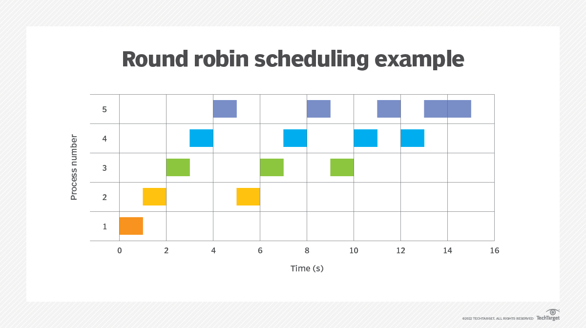

# CS - Operating System

# 질문

### CPU 스케쥴링 과정에 대해 설명해주세요.

CPU가 한 프로세스 완료 후 다음 프로세스를 어떻게 고르느냐 선택하는 것을 스케쥴링 알고리즘이라고 합니다. 주로 선점형 스케쥴링과 비선점형 스케쥴링으로 나뉩니다.

### 선점형 스케쥴링과 비선점형 스케쥴링을 각각 설명해주세요.

선점형 스케쥴링은 프로세스가 CPU를 사용하고 있는 동안 다른 프로세스가 CPU를 강제로 점유 가능한 것입니다. 주로 쓰이는 알고리즘 종류로는 SRT, Round Robin, Multi level Queue가 있습니다.

비선점형 스케쥴링은 프로세스가 CPU를 사용하는 동안 I/O나 인터럽트 발생 또는 프로세스가 종료될 때까지 다른 프로세스가 CPU를 사용하지 못합니다. 주로 쓰이는 알고리즘 종류로는 FCFS, SFJ, Priority가 있습니다.

# 학습 내용

### 선점형 스케쥴링 알고리즘

1. SRT(Shortest Remaining Time) 스케줄링
    - 짧은 시간 순서대로 프로세스를 수행한다.
    - 현재 CPU에서 실행 중인 프로세스의 남은 CPU 버스트 시간보다 더 짧은 CPU 버스트 시간을 가지는 프로세스가 도착하면 CPU가 선점된다.
2. Round Robin 스케줄링
    - 시분할 시스템의 성질을 활용한 방법
    - 일정 시간을 정하여 하나의 프로세스가 이 시간동안 수행하고 다시 대기 상태로 돌아간다.
    - 그리고 다음 프로세스 역시 같은 시간동안 수행한 후, 대기한다. 이러한 작업을 모든 프로세스가 돌아가면서 진행하며, 마지막 프로세스가 끝나면 다시 처음 프로세스로 돌아와서 작업을 반복한다.
    - 일정 시간을 Time Quantum(Time Slice)라고 부른다. 일반적으로 10 ~ 100msec 사이의 범위를 갖는다.
    - 한 프로세스가 종료되기 전에 time quantum이 끝나면 다른 프로세스에게 CPU를 넘겨주기 때문에 선점형 스케줄링의 대표적인 예시다.
    
    
    
3. Multi-level Queue 스케줄링
    - 프로세스를 그룹으로 나누어, 각 그룹에 따라 Ready Queue(준비 큐)를 여러 개 두며, 각 큐마다 다른 규칙을 지정할 수도 있다.(ex. 우선순위, CPU 시간 등)
    - 즉, 준비 큐를 여러 개로 분할해 관리하는 스케줄링 방법이다.
    - 프로세스들이 CPU를 기다리기 위해 한 줄로 서는 게 아니라 여러 줄로 선다.
    
    
    

### 비선점형 스케쥴링 알고리즘

1. FCFS(First Come First Server)
    - 준비 큐에 먼저 도착한 프로세스가 먼저 CPU를 점유하는 방식이다.
    - CPU를 할당받으면 CPU 버스트가 완료될 때까지 CPU를 반환하지 않으며, 할당되었던 CPU가 반환될 때만 스케줄링이 이루어진다.
    
    
    
    - 평군 대기시간 비교로 효율성을 판단한다 → 가장 효율적이지 않은 경우를 **Convoy Effect**라고 함
    - (0 + 10 + 15 + 17 + 23) / 5 = 13msec
2. SJF(Shortest-Job-First)
    - 그리디 알고리즘의 한 종류
    - 다른 프로세스가 먼저 도착했더라도 CPU 버스트가 짧은 프로세스에게 CPU를 먼저 할당하는 방식이다.
    - 선점, 비선점 모두 가능하다.
    
    
    
3. Priority
    - 우선순위가 높은 프로세스가 먼저 선택되는 스케줄링 알고리즘이다.
    - 우선순위는 정수값으로 나타내며, 작은 값이 우선순위가 높다.(Unix/Linux 기준)
    - 선점, 비선점 모두 가능하다.
    - 우선순위를 정하는 방법은 크게 내부적인 요소와 외부적인 요소로 나뉜다.
        - Internal : time limit, memory requirement, I/O to CPU burst(I/O 작업은 길고, CPU 작업은 짧은 프로세스 우선) 등
        - External : amout of funds being paid, political factors 등
        - 단점 : Starvation(기아) 현상
        
        <aside>
        ➕ **aging**
        
        ---
        
        - ready queue에서 일정 시간이 지나면 우선 순위를 일정량 높여주는 것.
        - 우선순위가 매우 낮은 프로세스라 하더라도, 기다리는 시간이 길어질수록 우선순위도 계속 높아지므로 수행될 가능성이 커짐
        </aside>