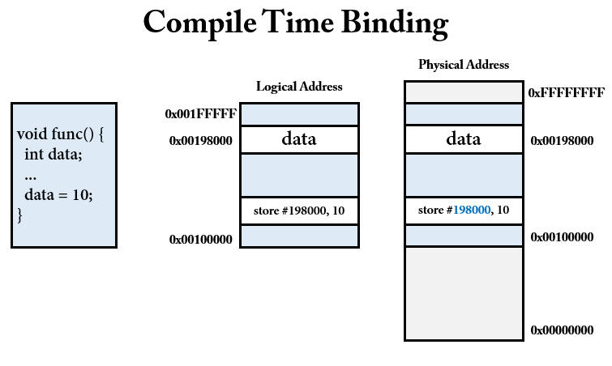
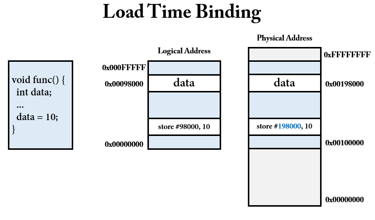
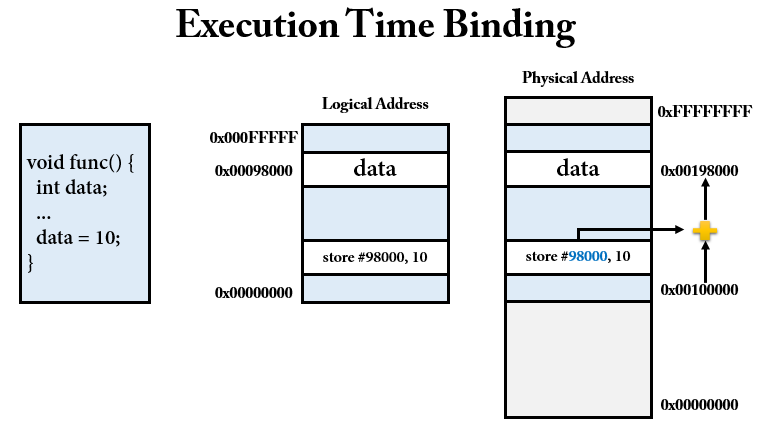

# Q1. OS에서 주소바인딩이 무엇입니까?

# Q2. OS에서 스와핑이 무엇입니까?


# CPU 와 메인 메모리

하드웨어에서 애플리케이션이 어떻게 실행되는지 알아보면,

자바 언어로 우리는 프로그램(명령어, 코드 및 정적인 데이터의 묶음이며 아직 실행되지 않은 상태를 의미)을 짠다.

```java
public static void main(String[] args) {
    # '. j a v a'
}
```

위와 같은 코드들이 프로그램이다. 프로그램이 실행되면 프로세스가 된다. 즉, 하나의 애플리케이션이 실행될때 애플리케이션에 있는 데이터들이 메모리에 로드되면서 프로세스가 생성된다.

자바로 따지면 `Compiler` 가 바이트 코드로 쓰여진 `class 파일`을 만들고 `Interpreter` 가 한 줄 씩 해석하여 `기계어`로 번역한다.

그리고 메모리에 로드되는 순간 이제 프로그램이 아닌 `프로세스`가 되는 것


```
Source > Compile > Binary > Process(메모리에 로드된 상태)
```

>  프로세스는 실행 중인 프로그램이다.

실행 중이라는 것은 메모리에 적재되어있다는 것임을 알 수 있다. 따라서, `프로그램이 메모리에 적재되는 순간` 프로세스가 된다.

이제 메인 메모리에 로드된 데이터들이 `CPU 와의 연산`에 의해서 프로그램이 실행되고 동작하는 것이다.

즉, CPU 는 모든 실행되는 명령과 데이터들을 `메인 메모리`에서 가져온다.

# 논리 주소와 물리 주소

프로세스는 실행을 위해 메모리에 적재되면 프로세스를 위한 독자적인 주소공간이 생긴다. 이 주소를 `논리적 주소(logical address)`라고 한다. 

논리적 주소는 각 프로세스마다 독립적으로 할당된다. 즉, 프로세스의 메모리 영역(코드, 데이터, 힙, 스택)에 할당되는 주소들을 논리 주소라고 부른다. 따라서, 웹 애플리케이션에서 작성한 코드들이 프로세스의 메모리 영역에 할당될 것이며, 각 논리 주소가 부여될 것이다. 그리고 웹 애플리케이션이 실행되어 메모리에 적재되면 기억장치 메모리의 주소도 있을텐데, 그곳에서 할당되는 주소를 `물리 주소(physical address)`라고 한다.

> 물리 주소는 메모리 주소 레지스터(Memory Address Register)에 부여되는 주소라고 생각하면 된다.

# 주소 바인딩

문제는 논리 주소와 물리 주소를 사용할때 서로 주소 값이 매칭이 되지 않는 문제가 발생할 수 있다.
주소 바인딩을 통해서 왜 그런 현상이 발생할 수 있는지 배워보자.

주소 바인딩(Address Binding)은 프로그램의 `명령어`와 `데이터`를 메모리에 적재할 때, 그것들의 메모리 주소를 결정하는 것을 의미한다.

프로그램에서 사용하는 `심볼(전역변수, 함수 등)`은 메모리의 어떤 주소가 있어야, 실행될 때 그 주소를 사용하여 접근(읽기/쓰기)할 수 있다.

```java
public void func() {
    int data = 10;
}
```

위 와 같은 코드는 data 라는 메모리 번지에 10을 쓰는 프로그램입니다. 위 코드를 실제로 CPU 가 명령어를 수행을 하면 다음과 같다.

```java
// #198000 은 임의의 데이터가 저장될 주소를 의미한다.
// store 는 어셈블리 명령어를 의미한다.
store #198000, 10
```

이, data 라고 하는 메모리 번지를 언제 결정하느냐에 따라 세 가지 방식으로 나뉜다.

- __컴파일 시간 바인딩(Compile time Binding)__
- __적재 시간 바인딩(Load time Binding)__
- __실행 시간 바인딩(Execution time Binding)__

정리하자면 메모리 번지를 언제 결정할 것인지를 정하는 것을 주소 바인딩이라고 한다.
아래에서 자세히 배워보자.

## 컴파일 시간 바인딩



> Physical Address 는 RAM 이라고 생각하면 된다.

지금 현재 Logical Address 에서 `0x00100000 ~ 0x00198000` 주소 범위에 func() 함수 내의 데이터와 변수 등이 저장되어있다. 그리고 Physical Address 또한 같은 주소를 부여 받았음을 알 수 있다.

즉, 컴파일 시간 바인딩은 `프로그램 내부에서 사용하는 주소(논리 주소)와 물리 주소가 동일`하다는 것을 알 수 있다.

- __특징__
  - 논리 주소와 물리 주소가 같다.
    - 정확하게 말하면 논리 주소를 물리적 주소로 변환시켜준다.
  - 컴파일 시간에 절대 코드(absolute code)를 생성한다.
    - 절대 코드란, 코드가 이미 정해진 메모리 주소에 로드되는 것을 말한다.
  - 프로그램을 메모리 내에 적재할 위치를 컴파일 시간에 결정한다.
  - 컴파일 시간에 물리적 메모리 주소를 결정한다.
  - 멀티 프로세스, 멀티 쓰레드 환경의 프로그래밍에서는 이 방식을 사용하기 힘들다.

프로그램에서 A 주소에, 바인딩해! 라고 했는데 그 주소를 이미 다른 프로세스가 차지하고 있다면, 사용하지 못할것이다. 컴파일 타임 방식을 사용했다는 것은 우리가 짠 코드가 어느 physical address 에 바인딩되어 수행된다고 가정하고 만드는 것이기 때문에, 이 방식은 사용하지 않는다. MS-DOS 의 .com 양식 프로그램이나, 아두이노 같은데서는 사용한다고 한다.

## 적재 시간 바인딩



적재 시간 바인딩(Load Time Binding)은 말 그대로 `로딩할때 물리 주소를 결정`하는 방식이다. 따라서, 프로그램 내부에서 사용하는 주소랑 물리 주소가 다르다.

적재 시간 바인딩에서는 프로그램 내부에서 `상대 주소`라는 개념을 도입해서 사용한다. 위 그림으로 보면 data 가 0번지 부터 98000번지에 위치하니까 RAM 에 로드될때 위치가 10만 번지에 로드되었다고하면, 상대 주소에 10만의 값만 더해주면된다.

- __특징__
  - 논리 주소와 물리 주소가 다르다.
  - 적재(Load)시간에 물리 주소를 결정한다.
  - 컴파일 타임과 달리 주소가 변경되기 때문에 `재배치 가능한 코드(relocatable code)`의 특징을 가진다.
    - 이렇게 재배치 가능한 코드를 가지면, 주소가 바뀌어도 다시 적재만 해주면된다.
  - 이처럼 로드 타임 바인딩은 프로그램 안에서 사용되는 메모리 주소를 이 프로그램 전체를 로딩할 때 이 프로그램이 메모리 어느 위치에 로딩되는지에 따라서 주소를 바꾼다.

적재 시간 바인딩의 단점은, 프로그램 안에 코드들과 데이터, 명령들이 엄청 많을텐데 이것을 로딩할 때마다 주소를 결정하게 되면 메모리를 로딩할 때 시간이 오래 걸린다는 단점이 있다. 따라서, 실제로는 잘 사용되지 않는다고 한다.

## 실행 시간 바인딩 



실행 시간 바인딩(Execution Time Binding)은 실행할 때 물리 주소를 바꾸는 방법이다. 

실행 시간 바인딩의 특징은 바로 `더하기 연산`을 한다는 것인데, 더하기 연산을 하는 위치를 보면 하드웨어다. 즉, 더하기 연산을 수행하기 위한 하드웨어가 별도로 필요한데 이것이 `MMU(Memory Management Unit)` 이다.

> MMU 란 CPU 코어 안에 탑재되어 가상 주소를 실제 메모리 주소로 변환해주는 장치를 의미한다.

요즘에는 하드웨어 성능이 좋아져서 실행 시간 바인딩을 실행하더라도 성능상 문제가 없다고 한다.


## Q1. OS에서 주소바인딩이 무엇입니까?

* 주소 바인딩(Address Binding)은 프로그램의 `명령어`와 `데이터`를 메모리에 적재할 때, 그것들의 메모리 주소를 결정하는 것을 의미합니다. 즉, 메모리 번지를 언제 결정할 것인지를 정하는 것입니다. 컴파일시간 바인딩, 적재시간 바인딩, 실행시간 바인딩이 있습니다. 
* 컴파일 시간 바인딩은 컴파일시 프로그램 내부에서 사용하는 주소(논리 주소)와 물리 주소가 동일하게 메모리 번지를 결정합니다. 적재 시간 바인딩(Load Time Binding)은 말 그대로 로딩할때 물리 주소를 결정하는 방식이다. 프로그램 내부에서 사용하는 주소랑 물리 주소가 다르다. 실행 시간 바인딩(Execution Time Binding)은 실행할 때 물리 주소를 바꾸는 방법이다. 


# 스와핑(Swapping)

스와핑(Swapping)은 원어 그대로 `교체`라는 의미를 지닌다. 무엇을 교체하는지 배워보자.

프로세스가 실행 되기 위해서는 메모리에 있어야 하지만, 프로세스는 실행 중에 임시로 `예비 저장장치(backup store)`로 내보내어졌다가 실행을 계속하기 위해 다시 메모리로 돌아올 수있다.

> 여기서 설명하는 backup store 에는 하드디스크나, ssd 같은 storage 를 의미한다.

예를 들어, 최대 메모리에 20 개의 프로세스를 올릴 수 있다고 가정하자. 메모리가 꽉찬 상태에서 21번째의 프로세스가 실행되면, 이미 실행 중인 프로세스를 잠시 backup store 에 저장했다가, 그 빈 공간에 새로운 프로세스를 집어 넣는다. 


위 그림을 보자.

처음에 실행 준비가 된 모든 프로세스들은 `준비 리스트(준비 완료 큐)`에 들어가 있어야 하며, CPU 스케줄러가 다음 실행할 프로세스를 선정할 때, 디스패처(Dispatcher) 를 호출한다. 디스패처는 준비 리스트에 있는 다음 프로세스가 메모리에 올라와 있는지 확인하여, 만약 올라와 있지 않다면 디스크에서 불러들인다. 그런데 만약에 실행 시킬 프로세스를 위한 공간이 메모리에 없다면 공간을 만들기 위해 현재 메모리에 올라와 있는 프로세스를 내보내고(swap-out), 실행시킬 프로세스를 메모리에 적재한다.

즉, 프로세스를 backup store 로 쫓아내는 것을 `swap-out` 이라고 하며, `swap-in`은 backup store 에 저장되어있던 녀석을 다시 메모리에 올려서 수행시켜주는 것을 의미한다. backup store 에 저장되어있던 프로세스를 다시 메모리에 로딩 시켜야하므로 교체 과정에서 `context switching`이 발생한다. 

프로세스의 Context-Swithcing 비용은 크기 때문에 현대 운영체제에서는 `스와핑`이 사용되지 않는다. 대신 스와핑을 변형한 방식을 사용한다고 한다.(Ex. UNIX, Linux, Windows 등) 이 부분에서는 다루지 않을 것이다.

이 스와핑 개념은 `VMM(Virtual Memory Management)` 방식과 유사하다. VMM 은 가상 메모리 관리라는 개념인데, 가상 메모리 자체가 8기가 메모리에서 10 기가 짜리 프로그램을 돌리게 할 수 있는 기법이다. 

스와핑은 swap-in, swap-out 의 단위가 `프로세스(process)`인 반면, VMM 은 `페이징(paging)`이라는 단위로 스와핑을 실시한다.

- __정리__
  - 스와핑(Swapping) : 메모리에 적재한 하나의 프로세스와 보조기억장치(backup store)에 적재한 다른 프로세스의 메모리를 교체하는 방법
  - 프로세스 단위의 스와핑은 `가상 메모리 관리 방법인 페이징 기법`으로 발전하였다.


## Q1. OS에서 스와핑이 무엇입니까?

* 메모리에 적재한 하나의 프로세스와 보조기억장치(backup store)에 적재한 다른 프로세스의 메모리를 교체하는 방법입니다.
* swap out, swap in의 기능을 가지고, 프로세스를 보조기억장치(backup store)로 쫓아내는 것을 `swap-out` 이라고 하며, backup store 에 저장되어있던 프로세스를 다시 메모리에 올려서 수행시켜주는 것을 `swap-in`이라고 합니다.


## References
