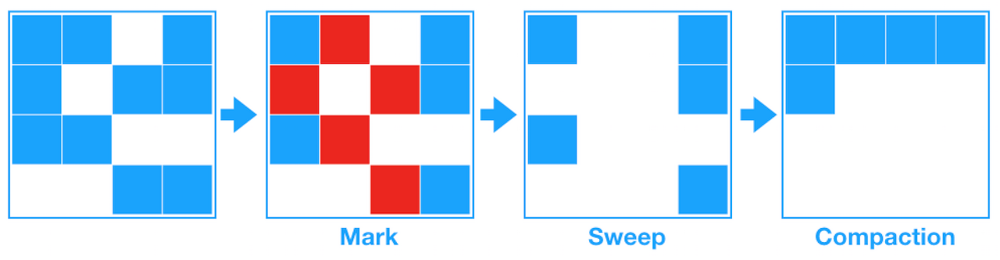

# CS - Java

# 질문

### 자바 코드가 실행되는 순서를 설명해보세요

1. 컴파일
    1. `.java` 파일을 javac으로 컴파일하면 `.class` (바이트코드) 파일이 생성됨
2. 런타임
    1. `.class` 파일을 `Class Loader`가 `JVM(Java Virtual Machine)`의 `RunTime Data Area`로 옮긴다.
    2. `Execution Engine` 가 JVM 메모리 영역에 적재된 `.class` 파일을 기계어로 변경하여 명령어(instruction) 단위로 실행.

### JVM의 구조에 대해 설명해주세요

`Class Loader`, `Execution Engine`, `Runtime Data Area`, `Garbage Collector` 4가지로 이루어져 있습니다.

### Runtime Data Area는 어떤 구조로 이루어져 있나요

`Method Area`, `Heap Area`, `Stack Area`, `PC Register`, `Native Method Stack` 다섯 가지로 이루어져 있습니다.

### Garbage Collector의 동작 원리에 대해 설명해주세요

Runtime Date Area의 Heap Area, Method Area를 대상으로 작동하며, 동적으로 할당했던 메모리 영역 중 필요 없게 된 메모리 영역을 주기적으로 삭제하는 역할을 합니다. 삭제되는 대상은 Heap Area에서 더 이상참조되지 않는 변수들 입니다.

# 학습 내용

### 참조링크

[https://www.geeksforgeeks.org/differences-jdk-jre-jvm/](https://www.geeksforgeeks.org/differences-jdk-jre-jvm/)

[https://velog.io/@minbo2002/자바-컴파일과-실행과정](https://velog.io/@minbo2002/%EC%9E%90%EB%B0%94-%EC%BB%B4%ED%8C%8C%EC%9D%BC%EA%B3%BC-%EC%8B%A4%ED%96%89%EA%B3%BC%EC%A0%95)

[https://tjdrnr05571.tistory.com/19](https://tjdrnr05571.tistory.com/19)

[https://coding-factory.tistory.com/828](https://coding-factory.tistory.com/828)

[https://coding-factory.tistory.com/829](https://coding-factory.tistory.com/829)

[https://www.geeksforgeeks.org/differences-jdk-jre-jvm/](https://www.geeksforgeeks.org/differences-jdk-jre-jvm/)

[https://www.baeldung.com/java-classloaders](https://www.baeldung.com/java-classloaders)

[https://www.baeldung.com/java-jvm-run-time-data-areas](https://www.baeldung.com/java-jvm-run-time-data-areas)

### Javac

- 오라클에서 만든 Java 코드를 컴파일하는 컴파일러 중 하나, java로 작성되어 있다.
- 다른 대체제로선 GNU에서 만든 GCJ가 존재한다.

## JVM

### Class Loader

- JRE(Java Runtime Enviornment)에 존재
- 바이트코드로 구성된 `.class` 파일을 런타임 때 동적으로 JVM 내부의 `Runtime Data Area`로 옮긴다.

### Execution Engine

- Interpreter
    - .class 파일 내부의 바이트코드를 순서대로 번역함.
    - 같은 내용이라도 여러번 번역하기 때문에 속도가 느림.
- JIT complier
    - Interpreter의 느린 속도와 낮은 성능을 개선하기 위하여 만들어짐.
    - JIT는 실행되고 있는 런타임 때 바이트코드를 기계어로 번역함.
    - JVM은 이미 컴파일 된 메서드는 다시 컴파일 하지 않음.
- Garbage Collector

### Runtime Data Area

1. Shared Data Area
    1. Heap Area
        1. 모든 자바 객체가 저장되는 런타임 데이터 영역
        2. JVM 실행 시 만들어지며 종료시 삭제
        3. Garbage Collector에 의해 관리됨
        4. 메모리가 다 차면 OutOfMemory 에러를 던짐
    2. Method Area
        1. 클래스와 인터페이스를 저장하는 런타임 데이터 영역
        2. 논리적으로 존재하며, Heap Area 내부에 있음.
2. Per-thread Data Area
    
    쓰레드마다 가지고 있는 데이터 영역. JVM은 멀티쓰레딩을 지원함
    
    1. PC Register
        1. 네이티브가 아닌 메서드의 경우, PC Register는 현재 실행되고 있던 명령어의 주소를 담는다.
        2. 네이티브 메서드의 경우, PC Register는 정의되지 않는 값을 가진다.
        3. 쓰레드의 수명 주기와 함께한다.
    2. Stack Area
        1. 쓰레드 속 함수의 호출 정보를 저장한다.
        2. 각 함수 호출마다 스택에 함수의 지역변수와 반환 주소를 저장한다.
    3. Native Method Stack
        1. 자바로 쓰이지 않은 메서드(바이트코드가 아님)을 위한 데이터 영역
        2. C 혹은 C++로 작성된 메서드

### Garbage Collector

할당한 메모리를 직접 해제해야하는 C와 C++와 다르게, Java는 Garbage Collector가 알아서 해준다.

- Reachabilty를 고려하여 삭제할 대상을 선택한다. → Heap Area의 객체 중 참조 변수가 없는 것들
- Mark and Sweep 알고리즘
    
    
    
    1. **Mark :** 먼저 Root로부터 그래프 순회를 통해 연결된 객체들을 찾아내어 각각 어떤 객체를 잠조하고 있는지 찾아서 마킹합니다.
    2. **Sweep :** 참조하고 있지 않은 객체 즉 Unreachable 객체들을 Heap에서 제거합니다.
    3. **Compact :** Sweep 후에 분산된 객체들을 Heap의 시작 주소로 모아 메모리가 할당된 부분과 그렇지 않은 부분으로 압축합니다. (가비지 컬렉터 종류에 따라 하지 않는 경우도 있음)
- Old와 Young generation으로 Heap Area를 나눠서 처리함.
    - Young 영역
        - 새롭게 생성된 객체는 young 영역에 할당.
        - 영역이 꽉 차면 minor GC가 수행된다.
    - Old 영역
        - 영역이 꽉 차면 Old 영역으로 객체를 옮김
        - major GC가 발생하면 GC를 제외한 모든 스레드가 멈춘다.

### JDK vs JRE vs JVM

> **JVM ⊂ JRE ⊂ JDK**
> 
- JDK (Java Development Kit) : 자바 프로그램을 개발하고 실행하는 환경을 제공.
- JRE (Java Runtime Environment) : 사용자 환경에서 자바 프로그램을 실행할 수 있는 환경을 제공.
- JVM (Java Virtual Machine) : 자바 프로그램 혹은 다른 언어로 쓰여졌으나 자바 바이트코드로 컴파일된 언어를 실행하는 가상머신

### JVM을 통해 실행되는 언어들

1. Java
2. Kotlin : JetBrains에서 2011년에 공개한 오픈 소스 프로그래밍 언어. 더 간결한 문법과 다양한 기능을 추가하였다. JVM 바이트코드가 기본이지만, Kotlin/Native 컴파일러를 사용하여 기계어로 컴파일할 수 있다. 안드로이드 개발에 사용된다.
3. Scala : 스칼라는 객체 지향 프로그래밍 언어와 함수형 프로그래밍의 요소가 결합된 다중패러다임 프로그래밍 언어이다. 빅데이터 처리를 위한 Spark에서 사용된다.
4. Clojure : LISP에서 아이디어를 얻은 함수형 프로그래밍 언어
5. Groovy : 클로저 함수 혹은 함수형 프로그래밍을 지원. Gradle에서 주로 사용함.
6. 기타 등등