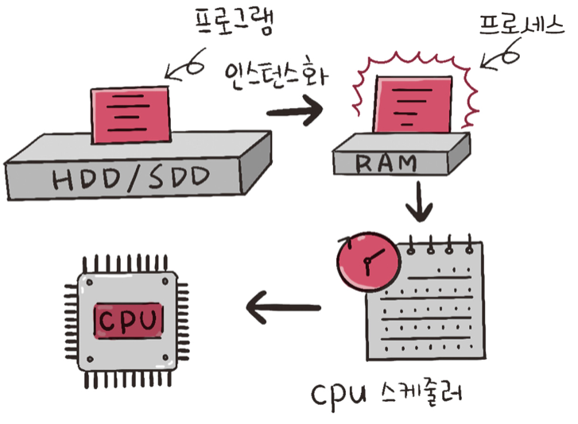

# CS - Operating System (2)

# 학습내용

> 출처 : 면접을 위한 CS 전공지식 노트
> 

## 프로세스와 스레드

- 프로세스 : 컴퓨터에서 실행되고 있는 프로그램. CPU 스케쥴링의 대상이 되는 task와 거의 같은 의미.
- 스레드 : 프로세스 내부 작업의 흐름

1. 프로그램이 메모리에 올라가면 프로세스 
(인스턴스화)
1. OS의 스케줄러에 따라 CPU가 프로세스를 실행

### 컴파일 과정

컴파일러가 컴파일 과정을 거쳐 컴퓨터가 이해할 수 있는 기계어로 번역되어 실행될 수 있는 파일이 되는 것

컴파일 과정 (c언어 기준)

- 전처리 : 주석 제거 및 헤더 파일 병합
- 컴파일러 : 오류 처리 및 코드 최적화 작업 후 어셈블리로 전환
- 어셈블러 : 어셈블리 코드를 .obj의 목적 파일로 변환
- 링커 : 프로그램 내의 라이브러리 혹은 다른 파일의 목적 코드와 합쳐 실행파일로 변환

### 프로세스의 상태

- 생성 상태 : 프로세스가 생성된 상태. PCB가 할당 됨
- 대기 상태 : 메모리 공간이 충분하면 할당 받고, 아니면 대기. CPU 스케줄러로부터 소유권이 넘어올 때까지 대기.
- 대기 중단 상태 : 메모리 부족으로 일시 중단된 상태
- 실행 상태 : CPU 소유권과 메모리를 할당받고 명령어를 수행 중인 상태. CPU burst가 일어났다고도 함
- 중단 상태 : 이벤트가 발생된 이후 기다리며 프로세스가 차단된 상태
- 일시 중단 상태 : 중단 상태에서 프로세스가 실행되려 했지만, 메모리 부족으로 일시 중단.
- 종료 상태 : 메모리와 CPU 소유권을 모두 놓고 가는 상태

### 프로세스의 메모리 구조

- 스택 : 지역 변수, 매개 변수, 함수가 저장. 컴파일 시 크기 결정.
- 힙 : 동적 할당 시 사용됨. 런타임 시 크기가 결정 됨.
- 데이터 영역 : 전역 변수, 정적 변수가 저장됨. BSS와 Data 영역으로 나뉨.
- 코드 영역 : 프로그램에 내장되어 있는 소스코드가 들어가는 영역

### PCB

- OS에서 프로세스에 대한 메타데이터를 저장한 데이터
- 프로세스 생성 시 OS는 해당 PCB를 생성함
- PCB의 구조
    - 프로세스 스케줄링 상태 : `준비`, `일시 중단` 등 프로세스가 CPU에 대한 소유권을 얻은 이후의 상태
    - 프로세스 ID : 프로세스 ID, 해당 프로세스의 자식 ID
    - 프로세스 권한 : 컴퓨터 자원 또는 I/O 디바이스에 대한 권한 정보
    - 프로그램 카운터 : 프로세스에서 실행해야 할 다음 명령어의 주소에 대한 포인터
    - CPU 레지스터 : 프로세스를 실행하기 위해 저장해야 할 레지스터에 대한 정보
    - CPU 스케줄링 정보 : CPU 스케줄러에 의해 중단된 시간 등에 대한 정보
    - 계정 정보 : 프로세스 실행에 사용된 CPU 사용량, 실행한 유저의 정보
    - I/O 상태 정보 : 프로세스에 할당된 I/O 디바이스 목록

### 컨텍스트 스위칭

- PCB를 교환하는 과정. 할당 된 시간이 다 되거나 인터럽트에 대해 발생함
- 싱글 코어 기준으로 한번에 하나의 프로세스만 실행 가능

컨텍스트 스위칭 과정. 유휴 시간과 캐시 미스 비용이 발생

- 유휴 시간 (Idle time) : PCB를 저장하고 로드하는 일련의 과정에서 발생하는 시간
- 캐시 미스 : 프로세스가 가지고 있는 캐시 주소를 비우는 과정
- 스레드에서도 발생함 → 프로세스의 컨텍스트 스위칭보다 비용이 적고 시간이 덜 걸림

### 멀티프로세싱

여러개의 프로세스를 병렬적으로 사용하여 두가지 이상의 일을 수행할 수 있는 것

- IPC (Inter Process Communication) : 프로세스끼리 데이터를 주고받고 공유 데이터를 관리
    - 공유 메모리 : 여러 프로세스에 동일한 메모리 블록에 접근할 수 있도록 함.
    - 파일 : 디스크 혹은 파일 서버에서 제공한 데이터
    - 소켓 : 네트워크 인터페이스를 통해 전송하는 데이터. TCP와 UDP가 있음
    - 익명 파이프 : 프로세스 사이에 FIFO로 읽히는 임시 공간을 만들어 데이터를 주고 받음. 단방향의 읽기 전용, 쓰기 전용 파이프를 만들어서 작동함. 부모 자식 관계에서만 사용 가능
    - 명명 파이프 :  파이프 서버와 하나 이상의 파이프 클라이언트 간의 통신을 위한 명명된 단방향 혹은 이중 파이프.
        
        
        
    - 메시지 큐 : 메시지를 큐 자료 구조로 관리. 커널에 의해 관리되며 다른 방식에 비해 직관적이고 간단함.

### 스레드와 멀티스레딩

- 스레드 : 프로세스의 실행 가능한 가장 작은 단위. 코드 데이터 힙은 스레드끼리 공유함
- 멀티스레딩
    - 프로세스 내 작업을 여러 개의 스레드로 처리하는 기법
    - 스레드끼리 서로 자원을 공유하기 때문에 효율이 높음.
    
    
    
    프로세스와 멀티스레드의 차이
    

### 공유 자원과 임계 영역

- 공유 자원
    - 시스템 안에서 프로세스와 스레드가 함께 접근할 수 있는 자원이나 변수
    - 두개 이상의 프로세스가 동시에 읽거나 쓰는 상황을 경쟁상태라고 함
- 임계 영역
    - 경쟁 상태에서 접근 시기, 순서에 따라 결과가 달라지는 코드 영역
    - 해결하기 위해선 상호 배제, 한정 대기, 융통성이라는 조건을 만족해야함
        - 상호 배제 : 한 프로세스가 임계 영역에 들어가면 다른 프로세스는 들어갈 수 없다
        - 한정 대기 : 특정 프로세스가 임계 영역에 영원히 들어갈 수 없어서는 안된다
        - 융통성 : 한 프로세스가 다른 프로세스의 일을 방해해선 안된다.
    - 뮤텍스, 세마포어, 모니터가 존재
- 뮤텍스
    
    
    
    - 프로세스나 스레드가 공유 자원을 lock()을 통해 잠그고, unlock()을 통해 잠근 해제하는 객체
    - 뮤텍스는 잠금, 잠금해제 두가지 상태를 가짐
- 세마포어
    
    
    
    - 일반화된 뮤텍스. 간단한 정수와 wait(), signal() 두가지 함수로 공유 자원에 대한 접근 처리
    - wait() : 자신의 차례가 올 때까지 기다리는 함수
    - signal() : 다음 프로세스로 순서를 넘겨주는 함수
    - 0-1로 구성된 바이너리 세마포어와 여러개의 값을 가지는 카운팅 세마포어가 존재.
    - 프로세스가 공유 자원에 접근 시 wait() 작업 수행. 끝나면 signal() 수행
- 모니터
    - 둘 이상의 스레드나 프로세스가 공유 자원에 안전하게 접근할 수 있게 공유 자원을 숨기고, 인터페이스만 제공
    - 모니터 큐를 통해 공유 자원에 대한 작업들을 순차적으로 처리

### 데드락

교착 상태라고도 부르며, 두개 이상의 프로세스들이 서로가 가진 자원을 기다리며 중단된 상태

- 교착 상태의 원인
    - 상호 배제 : 한 프로세스가 자원을 독점하고 있으며, 다른 프로세스가 접근 불가능
    - 점유 대기 : 특정 프로세스가 점유한 자원을 다른 프로세스가 요청하는 상태
    - 비선점 : 다른 프로세스의 자원을 강제적으로 가져올 수 없음
    - 환형 대기 : 프로세스들이 서로 자원을 요구하는 상황
- 해결 방법
    - 교착 상태의 조건이 성립되지 않도록 설계
    - 가능성이 없을 때만 자원을 할당함. 할당여부를 판단하기 위해 은행원 알고리즘 사용
    - 교착 상태 발생 시 사이클을 찾아보고 관련 프로세스를 지움
    - 교착상태 떄 처리하는 비용이 너무 크기 때문에 그냥 사용자가 작업을 종료함
    
    <aside>
    ➕ 은행원 알고리즘
    
    ---
    
    총 자원의 양과 현재 할당한 자원의 양을 기준으로 안정, 불안정 상태로 나누고, 안정 상태로 가도록 자원을 할당하는 알고리즘
    
    </aside>