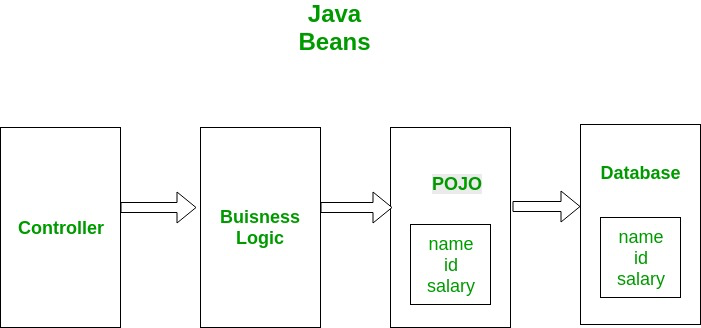

# CS - Spring Framework (1)

> https://www.digitalocean.com/community/tutorials/spring-interview-questions-and-answers#1-what-is-spring-framework를 참고하여 작성하였습니다.
> 

# 질문

### What is Spring Framework?

스프링은 가장 널리 사용되는 Java EE 프레임워크 중 하나입니다.

스프링 프레임워크의 핵심 개념은 "의존성 주입(Dependency Injection)"과 "관점 지향 프로그래밍(Aspect-Oriented Programming)"입니다. 

### What is the advantage of using Spring Framework?

- 애플리케이션의 다른 구성 요소 간의 직접적인 종속성을 줄입니다. 
→ 스프링 IoC 컨테이너는 리소스 또는 빈을 초기화하고 의존성으로 주입하는 역할을 담당.
- 비즈니스 로직이 실제 리소스 구현 클래스와 직접적인 종속성이 없어서 단위 테스트를 작성하기 쉬움
→ 테스트 구성을 쉽게 작성할 수 있고, 테스트 목적으로 모의 빈을 주입 가능.
- 객체 초기화, 리소스 오픈/클로즈와 같은 코드의 양을 줄임.
- 스프링 프레임워크는 여러 모듈로 나뉘어 있어 애플리케이션을 가볍게 유지하는 데 도움이 됨.
→ 스프링 트랜잭션 관리 기능이 필요하지 않다면 추가하지 않으면 됨.

### **How do we implement DI in Spring Framework?**

- 변수 선언부에 `@Autowired`를 적는 Field Injection
- Setter method 위에 `@Autowired`를 적는 Setter Injection
- 클래스 생성자 위에  `@Autowired`를 적는 Constructor Injection

Spring framework reference에서 추천하는 방법은 Constructor Injection입니다.

### POJO vs Java bean vs Spring bean

POJO는 Plain old java bean의 약자로서, 어느 프레임워크에 종속되지 않고 어느 자바 프로그램 위에서도 동작할 수 있는 객체.

Java bean은 POJO의 종류지만, 구현할 때 지켜야할 특별한 규칙들이 있습니다.

Spring bean은 스프링 프레임워크가 관리하는 자바 객체입니다. 스프링 컨테이너가 초기화하여 프로그램에 주입합니다.

# 학습 내용

## Spring Framework

Java Enterprise Edition을 위한 프레임워크 중 하나.

### Spring의 핵심 컨셉

- DI : 의존성을 낮추기 위한 개념. 각각의 계층이나 서비스의 의존성을 스프링 컨테이너가 연결해준다.
- IoC : 개발자가 아닌 IoC 컨테이너가 객체(bean)의 생명주기를 관리한다.
- AOC : 관점지향 프로그래밍. 여러 모듈에서 공통으로 사용하는 기능을 분리하여 관리한다.

### DI 주입 방법

1. Field Injection
    - 변수 선언부에 `@Autowired`를 적는 Field Injection
2. Setter Injection
    - Setter method 위에 `@Autowired`를 적는 Setter Injection
3. Constructor Injection
    - 클래스 생성자 위에  `@Autowired`를 적는 Constructor Injection

<aside>
➕ **Field Injection을 쓰지 말아야할 이유**

1. 단일 책임 원칙 (SRP) 위반
    
    `@Autowired` 아래에 제한 없이 변수를 추가할 수 있기 때문에 SRP를 위반하기 쉽다
    
2. 의존성이 숨는다
    
    클래스가 자신의 의존성 뿐만 아니라 제공된 의존성 또한 책임진다. 그래서 클래스가 어떤 의존성을 책임지지 않을 때, Setter나 Contructor를 통해 알려줘야 한다. 하지만 필드 주입은 숨은 의존성만 제공해준다.
    
3. DI Container의 결합성과 테스트 용이성
    
    각 클래스들은 의존성만 주입하면 독립적으로 생성되는 POJO여야 한다. 하지만 필드 주입을 하면 의존성을 가진 클래스를 인스턴스화할 수 없다.
    
4. 불변성
    
    필드 주입은 객체의 불변성을 제공할 수 없다.
    
5. 순환 의존성
    
    A가 B를 의존하고, B가 A를 의존하는 순환의존성을 필드 주입은 확인할 수 없다.
    
</aside>

### POJO

Plain Old Java Object라는 뜻으로, 특정 프레임워크에 종속되지 않는 객체이다.

비즈니스 로직이 DB에 접근하기 위해선 POJO를 거쳐서 접근해야 한다.

- 특징
    1. 미리 정의된 객체를 상속 받는 것이 아니어야 한다.
    2. 미리 정의된 인터페이스를 구현하는 것이 아니어야 한다.
    3. 미리 정의된 어노테이션을 쓰지 말아야 한다.

### Java bean

POJO의 부분 집합으로, 다음과 같은 규칙을 통해 POJO는 Java bean이 될 수 있다.

1. 직렬화가 가능해야한다. 이를 위해 serializable 인터페이스를 구현해야 한다.
2. 변수들은 private이여야 하고, getter와 setter를 통해 접근해야 한다.
3. 매개변수가 없는 생성자를 가지고 있어야 한다.

### Spring bean

Spring에 의하여 생성되고 관리되는 자바 객체. 싱글턴을 보장한다.

- 등록 방법
    1. `@Component` 어노테이션을 통해 스프링 컨테이너에 등록 가능
    2. bean configuration 파일에 `@Configuration` 과 `@bean` 어노테이션을 통해 직접 입력 가능
    3. ApplicationContext를 호출하여 수동으로 가져올 수 있다.